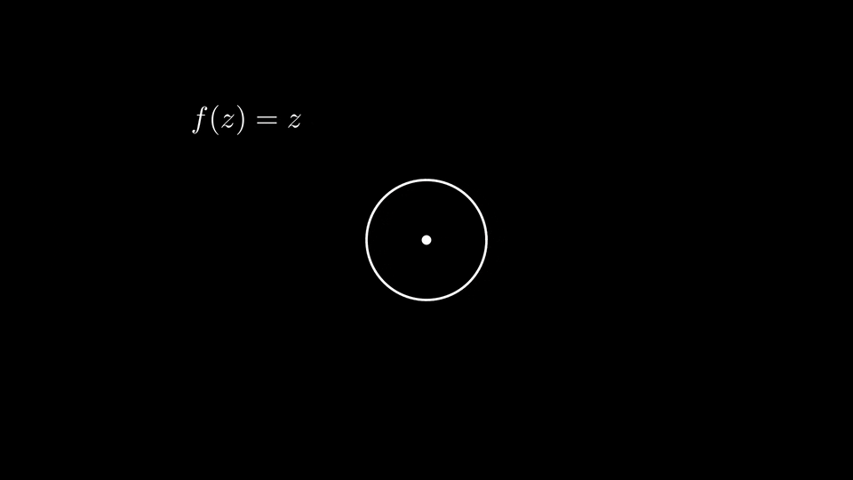

[Foliensatz](../../assets/2026/tut07/presentation.pdf)

## Kurzprotokoll

Wir begannen in beiden Tutorien mit einer Besprechung des Foliensatzes.
Aus Zeitgründen besprachen wir aber nur am Freitag die Bedeutung des Argumentprinzips für sogenannte domain colorings (vgl. unten).
Danach gingen wir zu den Aufgaben über.

## Zum Mitnehmen

### Aufgabe 1
- Anwendung des Satzes von Rouché (und Relevanz von diesem, sobald es um die Anzahl von Nullstellen holomorpher Funktionen innerhalb einer Kreisscheibe geht).
- Als kleine Ergänzung zum Tutorium sei folgende geometrische Interpretation vom Satz von Rouché gegeben (vgl. auch den englisch-sprachigen [Wikipedia-Artikel](https://en.wikipedia.org/wiki/Rouch%C3%A9%27s_theorem#Geometric_explanation)): Stellen wir uns vor, dass eine Person mit ihrem Hund Gassi geht und hierbei um einen Baum herum läuft.
    Solange die Leine immer kürzer gehalten wird als der Abstand zum Baum, so wird garantiert, dass der Hund genauso oft um den Baum läuft wie die Person selbst.
    Zwar kann der Hund wild um die Person herumrennen, aber dadurch, dass die Leine kurz genug ist, kann er nie zusätzliche Runden um den Baum drehen.
    Aus dieser geometrischen Überlegung gemeinsam mit dem Argumentprinzip kann man sich den Satz von Rouché herleiten, wobei der Baum den Ursprung darstellt und $$f(z)$$ (bzw. $$f(z) + g(z)$$) die Position der Person (bzw. des Hundes) angeben.

### Aufgabe 2
- Rechnen mit $$\operatorname{Log}$$ und komplexen Potenzen.
    Für Ersteres nochmal die Erinnerung, dass wir immer aufpassen müssen, dass wir beim Schreiben der jeweiligen komplexen Zahl in Polarkoordinaten entsprechend der Definition des Hauptzweiges das Argument aus dem Interval $$(- \pi, \pi)$$ wählen müssen (und entsprechend für andere Zweige des Logarithmus).
- Vorsicht: Im Allgemeinen übertragen sich bekannte Rechenregeln für Potenzen nicht direkt aus dem Reellen ins Komplexe.
    Hier ist es gegebenenfalls auch hilfreich, sich daran zu erinnern, dass die Formulierung "$$\mathrm{e}$$ hoch $$z$$" für $$\mathrm{e}^z$$ für beliebige $$z \in \mathbb{C}$$ _nicht_ ganz so passend ist und eher von der reellen Exponentiation herrührt (wobei natürlich auch die Schreibweise zu dieser Sprechweise veranlasst).
    Stattdessen sollte man im Hinterkopf behalten, dass $$\mathrm{e}^z$$ die über die Potenzreihe $$\sum_{k=0}^{\infty} \frac{z^k}{k!}$$ definierte komplexe Exponentialfunktion bezeichnet.
    Hierdurch kann man auch Fehler wie $$\mathrm{e}^{z w} = (\mathrm{e}^z)^w$$ vermeiden, was ein Beispiel für eine Rechenregel ist, die sich (aufgrund der Mehrwertigkeit komplexer Potenzen) nicht ohne Weiteres direkt für beliebige $$z, w \in \mathbb{C}$$ übertragen lässt.
    Man betrachte beispielsweise $$z = w = \mathrm{i} \pi$$ in welchem Fall die rechte Seite der Gleichung mit unserer Definition über den Hauptzweig des Logarithmus nicht definiert ist -- aber selbst wenn die rechte Seite definiert ist, so hängt sie ja noch immer von der Wahl des Logarithmus ab und für eine andere Wahl können beide Seiten dementsprechend sogar voneinander abweichen.
    Die bekannte Funktionalgleichung $$\mathrm{e}^{z} \mathrm{e}^{w} = \mathrm{e}^{z + w}$$ ist aber natürlich schon gültig, da diese direkte Konsequenz der Cauchy-Produktformel ist.

### Aufgabe 3
- "Trichotomie" für isolierte Singularitäten: Eine isolierte Singularität ist entweder hebbar, eine Polstelle oder wesentlich.
    In Anbetracht der Definition einer wesentlichen Singularität aus der Vorlesung ist dies natürlich nicht überraschend, aber kann nichtsdestotrotz hilfreich sein, indem es in einem Beweis als Basis für eine Fallunterscheidung verwendet wird.
- Hat $$f$$ eine Polstelle der Ordnung $$n \in \mathbb{N}$$ bei $$z_0 \in \mathbb{C}$$ und $$g$$ eine Polstelle der Ordnung $$m \in \mathbb{N}$$ bei $$z_0$$, so besitzt $$f \cdot g$$ eine Polstelle der Ordnung $$n + m$$ bei $$z_0$$.
    Ferner besitzt $$f'$$ bei $$z_0$$ eine Polstelle der Ordnung $$n + 1$$.
    In Worten: "Ableiten erhöht die Ordnung von Polstellen holomorpher Funktionen um eins."
    Analog gilt: "Ableiten verringert die Ordnung von Nullstellen einer holomorphen Funktion um eins."
    Beide Aussagen können direkt aus Lemmata 3.2 bzw. 3.1 aus dem Vorlesungsskript gefolgert werden, also indem man beispielsweise (für die Polstellen-Aussage) $$f(z) = (z - z_0)^{-n} h(z)$$ für eine holomorphe Funktion $$h$$ mit $$h(z_0) \neq 0$$ schreibt.

## Fun Fact

Zu Beginn des Freitags-Tutoriums haben wir auch über den Namen des Argumentprinzips geredet.
Hierfür als (nicht im Tutorium besprochene) Ergänzung folgende "formale" Rechnung (das heißt ohne Anspruch auf Rigorosität oder Beachtung von Fragen bezüglich -- bzw. Überprüfen von -- Konvergenz, Differenzierbarkeit, etc.): Schreiben wir $$f(z) = r(z) \mathrm{e}^{\mathrm{i} \vartheta(z)}$$ in einer Umgebung von $$C$$ mit $$r(z) > 0$$ (man beachte, dass $$f$$ keine Nullstellen auf $$C$$ hat) und $$\vartheta(z) \in \mathbb{R}$$, so erhalten wir im Argumentprinzip mithilfe der Produktregel:
\\[
    \frac{1}{2 \pi \mathrm{i}} \int_{C} \frac{f'(z)}{f(z)} \,\mathrm{d}z = \frac{1}{2 \pi \mathrm{i}} \int_{C} \frac{r'(z) \mathrm{e}^{\mathrm{i} \vartheta(z)}}{r(z) \mathrm{e}^{\mathrm{i} \vartheta(z)}} + \frac{r(z) \mathrm{e}^{\mathrm{i} \vartheta(z)} \mathrm{i} \vartheta'(z)}{r(z) \mathrm{e}^{\mathrm{i} \vartheta(z)}} \,\mathrm{d}z = \frac{1}{2 \pi \mathrm{i}} \left[ \int_{C} \frac{r'(z)}{r(z)} \,\mathrm{d}z + \mathrm{i} \int_{C} \vartheta'(z) \,\mathrm{d}z \right]
\\]
Wir wählen nun noch eine Parametrisierung für $$C$$, sagen wir $$z \colon [0, 2 \pi] \to C$$.
Da $$C$$ geschlossen ist, verschwindet das erste Integral gemäß Hauptsatz der Differential- und Integralrechnung:
\\[
    \int_{C} \frac{r'(z)}{r(z)} \,\mathrm{d}z = \int_{0}^{2 \pi} \frac{r'(z(t)) z'(t)}{r(z(t))} \,\mathrm{d}t = \int_{0}^{2 \pi} \frac{\mathrm{d}}{\mathrm{d}t} \ln(r(z(t))) \,\mathrm{d}t = \ln(r(z(2 \pi))) - \ln(r(z(0))) = 0.
\\]
Das zweite Integral kann ebenfalls direkt berechnet werden:
\\[
    \int_{C} \vartheta'(z) \,\mathrm{d}z = \int_{0}^{2 \pi} \vartheta'(z(t)) z'(t) \,\mathrm{d}t = \vartheta(z(2 \pi)) - \vartheta(z(0)).
\\]
Dies ist die Gesamtänderung des Arguments (also des "Winkels") von $$f(z)$$ während $$z$$ entlang $$C$$ läuft!
Das erklärt den Ursprung des Namens.

Diese Rechnung gibt auch Anlass zu einer schönen Visualisierung, indem man sich für jeden Punkt $$z$$ des Kreises, über welchen integriert wird, überlegt, was das Argument von $$f(z)$$ ist.
Hierfür kann man einen Pfeil, beginnend bei $$z$$, betrachten, der in Richtung $$e^{\mathrm{i} \vartheta(z)}$$ zeigt.

Dies ist in der folgenden Animation dargestellt, die wir im Freitags-Tutorium angeschaut haben.
Der Einfachheit halber wird hier für $$C$$ der Einheitskreis betrachtet:

{:refdef: style="text-align: center;"}

{: refdef}

Wir sehen, dass die Ordnung der Null- oder Polstelle mit der Gesamtanzahl an Umdrehungen des oben beschriebenen Pfeils übereinstimmt, wobei die Richtung, in welche rotiert wird, angibt, ob es sich um eine Null- oder Polstelle handelt.

Man vergleiche auch die entstehenden Einfärbungen des Einheitskreises, die auf der jeweiligen Richtung und Ordnung basieren.
Dies führt allgemeiner zu sogenannten _domain colorings_, was Visualisierungen komplexer Funktionen sind, an welchen man für holomorphe Funktionen (mithilfe der eben beschriebenen Konsequenz des Argumentprinzips) die Null- und Polstellen mitsamt ihrer Ordnung ablesen kann.
Für Details verweisen wir an dieser Stelle auf folgende Quelle (konkret Kapitel 1):

- [Wegert, E. (2012). Visual Complex Functions. Springer Basel.](https://doi.org/10.1007/978-3-0348-0180-5)

Natürlich ist obige Argumentation nicht allzu rigoros (wer will, kann sich gerne überlegen, wo Lücken sind und versuchen, diese zu schließen).

Insbesondere falls man Umlaufzahlen kennt, ist aber vielleicht diese Interpretation des Argumentprinzips schön gesehen zu haben.[^1]

[^1]: In diesem Fall kann man sich aber natürlich auch überlegen, dass die linke Seite des Integrals der Umlaufzahl von $$f(C)$$ um den Ursprung entspricht (vgl. die geometrische Interpretation des Satzes von Rouché).

Der Vollständigkeit halber hier auch noch Verlinkungen zu den [drei](https://de.wikipedia.org/wiki/Datei:Complex_x_hoch_3.jpg) [domain](https://de.wikipedia.org/wiki/Datei:Complex_x_hoch_5.jpg) [colorings](https://en.wikipedia.org/wiki/File:Essential_singularity.png), welche wir im Freitags-Tutorium nach Besprechung der obigen Bedeutung des Argumentprinzips betrachteten.

---
