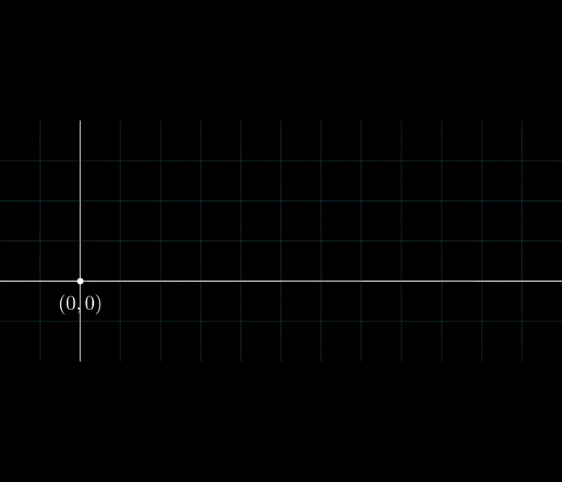
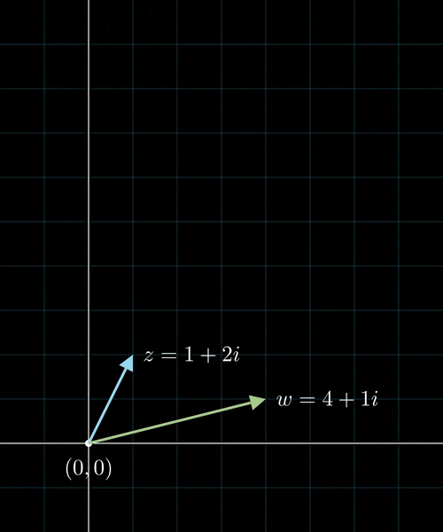
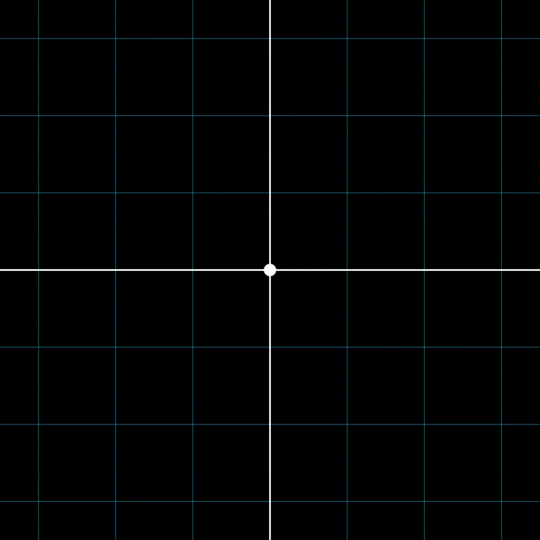

# Tutorium 0

[Zurück zur Startseite](../README.md)

## Kurzprotokoll

Wir haben mit Aufgabe 1 begonnen, wo wir neben den prinzipiellen Rechenregeln für Addition und komplexer Konjugation für Aufgabe (i) die folgenden Geogebra Applets für etwas geometrische Intuition besprachen:

1. [\|z + 1\| = \|z + 3\|](https://www.geogebra.org/m/byyfpkjy)
2. [1/z = z̅](https://www.geogebra.org/m/tgfk5ddr)
3. [\|z\| = Re(z)+1](https://www.geogebra.org/m/c57fmwd6)

Daraufhin haben wir mithilfe der folgenden Animationen (auch [hier](https://github.com/fdf-uni/ft/tree/main/assets/tut00) als Videos verfügbar) geometrische Interpretationen der komplexen Addition und Multiplikation wiederholt:
### Komplexe Addition
{:refdef: style="text-align: center;"}

{: refdef}
### Komplexe Multiplikation
{:refdef: style="text-align: center;"}

{: refdef}
### Komplexe Multiplikation als Rotation
{:refdef: style="text-align: center;"}

{: refdef}

Hieraufhin haben wir bei (iii) kurz über das Standardskalarprodukt auf $$\mathbb{C}$$ geredet und mithilfe der (teils bekannten) Standardbeweisstrategie der Parallelogramm-Gleichung die Aufgabe gelöst.

Danach haben wir über die übrigen Aufgaben geredet.

## Zum Mitnehmen

### Aufgabe 1
- Komplexe Zahlen können viele geometrische Konstruktionen beschreiben, beispielsweise Kreise, Mittelsenkrechten, Inversion am (Einheits-)kreis, Spiegelung an Achsen oder Parabeln.
- Komplexe Multiplikation mit $$r e^{i \varphi}$$ entspricht Skalierung um den Faktor $$r$$ und Rotation um den Winkel $$\varphi$$.
- "Faustregel": Addition klappt besser mit kartesischen Koordinaten, Multiplikation klappt besser mit Polarkoordinaten.
- Rechenregeln für komplexes Konjugieren.
- Ist $$\lvert z \rvert = 1$$ gegeben, so kann es hilfreich sein, $$z = e^{i \varphi}$$ für $$\varphi \in [0, 2\pi)$$ zu schreiben.

### Aufgabe 2
- Geometrische Reihe (Konvergenzverhalten & Grenzwert).
- Konvergenzverhalten in Abhängigkeit des Konvergenzradius (und Definition des Letzteren).
- Cauchy-Hadamard und "Quotientenformel" (à la d'Alembert/Cauchy) zur Berechnung des Konvergenzradius.
- Potenzreihen können innerhalb des Konvergenkreises termweise differenziert werden und der Konvergenzradius ändert sich hierdurch nicht.

### Aufgabe 3
- Definition partieller Ableitung und totaler Ableitung.
- Form der totalen Ableitung in Abhängigkeit der partiellen Ableitungen (Spalten der Jakobimatrix sind partielle Ableitungen).
- Um Nicht-Differenzierbarkeit zu zeigen, kann oft ein Widerspruchsbeweis hilfreich sein.
- Stetig differenzierbar $$\iff$$ stetig partiell differenzierbar.

## Fun Facts

Die Frage nach der Konvergenz einer Potenzreihe auf dem Rand des Konvergenzkreises ($$\lvert z \rvert = R$$) kann relativ weit geführt werden.
Beispielsweise kann man sich überlegen, welche Teilmengen resultieren können, wenn diese genau die Punkte, für welche die Potenzreihe nicht konvergiert, beinhalten.
$$\sum_{k=0}^{\infty} z^n$$ konvergiert für alle $$\lvert z \rvert = 1$$ mit $$z \neq 1$$ und divergiert für $$z = 1$$.
Mittels Multiplikation von $$e^{\mathrm{i} \varphi}$$ und Addition findet man nun recht schnell, dass jede endliche Teilmenge von $$\partial B_1(0)$$ als "Nichtkonvergenzbereich" möglich ist.

Für eine deutlich ausführlichere Diskussion solcher Resultate mit Referenzen kann man beispielsweise [diesen Thread](https://mathoverflow.net/questions/49395/behaviour-of-power-series-on-their-circle-of-convergence) auf Math Overflow (und die dort verlinkten Texte) lesen.
