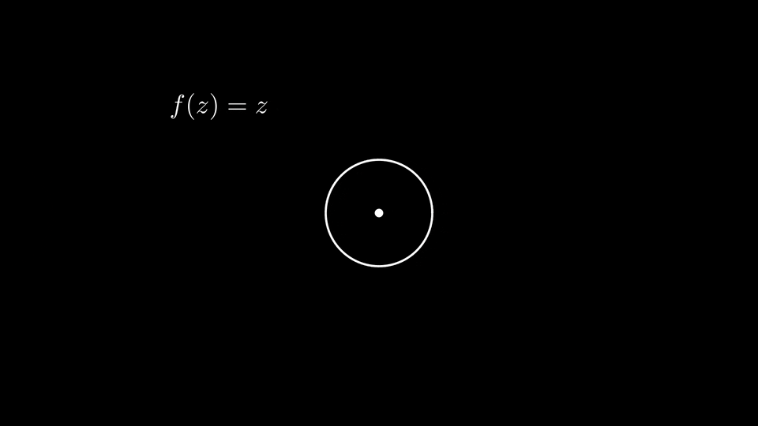

# Tutorium 8

[Zurück zur Startseite](../README.md)

[Foliensatz](../assets/tut08/presentation.pdf)

## Kurzprotokoll
Wie auch die anderen Tutorien begann dieses Tutorium mit der Besprechung des oben verlinkten Foliensatzes und endete mit der Besprechung der Aufgaben.

Zu Beginn haben wir auch über den Namen des Argumentprinzips geredet.
Hierfür als (nicht im Tutorium besprochene) Ergänzung folgende "formale" Rechnung (das heißt ohne Anspruch auf Rigorosität oder Beachtung von Fragen bezüglich -- bzw. Überprüfen von -- Konvergenz, Differenzierbarkeit, etc.): Schreiben wir $$f(z) = r(z) \mathrm{e}^{\mathrm{i} \vartheta(z)}$$ in einer Umgebung von $$C$$ mit $$r(z) > 0$$ (man beachte, dass $$f$$ keine Nullstellen auf $$C$$ hat) und $$\vartheta(z) \in \mathbb{R}$$, so erhalten wir im Argumentprinzip mithilfe der Produktregel:
\\[
    \frac{1}{2 \pi \mathrm{i}} \int_{C} \frac{f'(z)}{f(z)} \,\mathrm{d}z = \frac{1}{2 \pi \mathrm{i}} \int_{C} \frac{r'(z) \mathrm{e}^{\mathrm{i} \vartheta(z)}}{r(z) \mathrm{e}^{\mathrm{i} \vartheta(z)}} + \frac{r(z) \mathrm{e}^{\mathrm{i} \vartheta(z)} \mathrm{i} \vartheta'(z)}{r(z) \mathrm{e}^{\mathrm{i} \vartheta(z)}} \,\mathrm{d}z = \frac{1}{2 \pi \mathrm{i}} \left[ \int_{C} \frac{r'(z)}{r(z)} \,\mathrm{d}z + \mathrm{i} \int_{C} \vartheta'(z) \,\mathrm{d}z \right]
\\]
Wir wählen nun noch eine Parametrisierung für $$C$$, sagen wir $$z \colon [0, 2 \pi] \to C$$.
Da $$C$$ geschlossen ist, verschwindet das erste Integral gemäß Hauptsatz der Differential- und Integralrechnung:
\\[
    \int_{C} \frac{r'(z)}{r(z)} \,\mathrm{d}z = \int_{0}^{2 \pi} \frac{r'(z(t)) z'(t)}{r(z(t))} \,\mathrm{d}t = \int_{0}^{2 \pi} \frac{\mathrm{d}}{\mathrm{d}t} \ln(r(z(t))) \,\mathrm{d}t = \ln(r(z(2 \pi))) - \ln(r(z(0))) = 0.
\\]
Das zweite Integral kann ebenfalls direkt berechnet werden:
\\[
    \int_{C} \vartheta'(z) \,\mathrm{d}z = \int_{0}^{2 \pi} \vartheta'(z(t)) z'(t) \,\mathrm{d}t = \vartheta(z(2 \pi)) - \vartheta(z(0)).
\\]
Dies ist die Gesamtänderung des Arguments (also des "Winkels") von $$f(z)$$ während $$z$$ entlang $$C$$ läuft!
Das ist also der Ursprung des Namens.

Diese Rechnung gibt auch Anlass zu einer schönen Visualisierung, indem man sich für jeden Punkt $$z$$ des Kreises, über welchen integriert wird, überlegt, was das Argument von $$f(z)$$ ist.
Hierfür kann man einen Pfeil, beginnend bei $$z$$, betrachten, der in Richtung $$e^{\mathrm{i} \vartheta(z)}$$ zeigt.

Dies ist in der folgenden Animation dargestellt, die wir in den Tutorien angeschaut haben.
Der Einfachheit halber wird hier anstelle von $$C$$ der Einheitskreis betrachtet:

{:refdef: style="text-align: center;"}

{: refdef}

Wir sehen, dass die Ordnung der Null- oder Polstelle mit der Gesamtanzahl an Umdrehungen des oben beschriebenen Pfeils übereinstimmt, wobei die Richtung, in welche rotiert wird, angibt, ob es sich um eine Null- oder Polstelle handelt.

Man vergleiche auch die entstehenden Einfärbungen des Einheitskreises, die auf der jeweiligen Richtung basieren, mit den [letzte Woche](./tut07.md) kurz besprochenen domain colorings, insbesondere dem Ablesen von Null- und Polstellen mitsamt Ordnung aus diesen, was wie wir nun gesehen haben aufgrund des Argumentprinzips funktioniert (s. für Details beispielsweise das letzte Woche verlinkte Buch von E. Wegert).

Natürlich ist obige Argumentation nicht allzu rigoros (wer will, kann sich gerne überlegen, wo Lücken sind und versuchen, diese zu schließen).

Insbesondere falls man Umlaufzahlen kennt, ist aber vielleicht diese Interpretation des Argumentprinzips schön gesehen zu haben.[^1]

[^1]: In diesem Fall kann man sich aber auch überlegen, dass die linke Seite des Integrals der Umlaufzahl von $$f(C)$$ um den Ursprung entspricht.

## Zum Mitnehmen

### Aufgabe 1
- Rechnen mit $$\operatorname{Log}$$ und komplexen Potenzen.
- Vorsicht: Im Allgemeinen übertragen sich bekannte Rechenregeln für Potenzen nicht direkt aus dem Reellen ins Komplexe. Hier sollte man vielleicht auch etwas aufpassen und $$\mathrm{e}^z$$ _nicht_ als "$$\mathrm{e}$$ hoch $$z$$" lesen (auch wenn man das immer so sagt und natürlich auch die Schreibweise dazu veranlasst), sondern sich daran erinnern, dass $$\mathrm{e}^z$$ die über die Potenzreihe $$\sum_{k=0}^{\infty} \frac{z^k}{k!}$$ definierte komplexe Exponentialfunktion bezeichnet.
    Hierdurch kann man auch Fehler wie $$\mathrm{e}^{z w} = (\mathrm{e}^z)^w$$ vermeiden, was ein Beispiel für eine Rechenregel ist, die sich nicht direkt für beliebige $$z, w \in \mathbb{C}$$ übertragen lässt.
    Man betrachte beispielsweise $$z = w = \mathrm{i} \pi$$ in welchem Fall die rechte Seite der Gleichung mit unserer Definition über den Hauptzweig des Logarithmus nicht definiert ist -- aber selbst wenn die rechte Seite definiert ist, so hängt sie ja noch immer von der Wahl des Logarithmus ab und für eine andere Wahl können beide Seiten dementsprechend sogar voneinander abweichen.

### Aufgabe 3
- Eventuell "Wiederholung" der umgekehrten Dreiecksungleichung und Anwenden des Satzes von Rouché.
- Für Letzteres ist der Trick oft, eine gegebene Gleichung zu einer Nullstellengleichung umzuformen.

### Aufgabe 5
- Der Residuensatz gilt auch für wesentliche Singularitäten[^2], allerdings hat man hier nicht eine direkte Formel wie für die Residuen bei Polstellen (vgl. Lemma 3.3), sondern muss explizit die Laurent-Entwicklung berechnen, um die Residuen ermitteln zu können.

[^2]: Da in den Tutorien nach einem Beweis gefragt wurde, hier eine mögliche Skizze eines solchen: Die wesentliche Beobachtung ist, dass eine Laurent-Reihe $$\sum_{n = -\infty}^{\infty} a_n (z - z_0)^n$$ auf einem offenen Kreisring $$\{z \in \mathbb{C} : r < \lvert z - z_0 \rvert < R\}$$ konvergiert.
    Um dies zu zeigen, kann man die Laurent-Reihe in den _Hauptteil_ $$\sum_{n = -\infty}^{-1} a_n (z - z_0)^n = \sum_{n = 1}^{\infty} a_{-n} \left(\frac{1}{z - z_0}\right)^n$$ und den _Nebenteil_ (auch _regulärer Teil_ genannt) $$\sum_{n = 0}^{\infty} a_n (z - z_0)^n$$ zerlegen.
    Gemäß Cauchy-Hadamard (oder mittels Vergleich mit einer geometrischen Reihe) konvergiert die erste Reihe für $$\left\lvert \frac{1}{z - z_0} \right\rvert < \frac{1}{r} \iff \lvert z - z_0 \rvert > r$$ und die zweite für $$\lvert z - z_0 \rvert < R$$, wobei
    \\[
        r = \limsup_{n \to \infty} \sqrt[n]{\lvert a_{-n} \rvert} \qquad \text{und} \qquad \frac{1}{R} = \limsup_{n \to \infty} \sqrt[n]{\lvert a_n \rvert}
    \\]
    mit den üblichen Konventionen falls $$r$$ oder $$R$$ einen der Werte $$\{0, \infty\}$$ annehmen.
    Mit demselben Argument wie für Potenzreihen zeigt man, dass die Konvergenz lokal gleichmäßig ist (oder verwendet ein geeignetes Konvergenzkriterium), um zu beweisen, dass bei der Berechnung von Kurvenintegralen über im Konvergenzbereich enthaltenen Kurven Laurent-Reihen termweise integriert werden können.
    Sei nun $$f \colon \Omega \setminus \{z_0\} \to \mathbb{C}$$ holomorph mit einer isolierten (eventuell wesentlichen) Singularität bei $$z_0$$.
    Für klein genuges $$\epsilon > 0$$ konvergiert die Laurent-Entwicklung $$\sum_{n=-\infty}^{\infty} a_n (z - z_0)^n$$ von $$f$$ auf der punktierten Kreisscheibe $$B_{\epsilon}(z_0) \setminus \{z_0\}$$ (das folgt aus der Tatsache, dass die Singularität isoliert ist) und es folgt
    \\[
        \int_{C_{\epsilon}(z_0)} f(z) \,\mathrm{d}z = \sum_{n = -\infty}^{\infty} \int_{C_{\epsilon}(z_0)} a_n (z - z_0)^n \,\mathrm{d}z = 2 \pi \mathrm{i} a_{-1},
    \\]
    was mit dem üblichen "Korridor-/Schlüsselloch-Argument" den Residuensatz liefert.

## Fun Facts

Siehe obige Visualisierung des Argumentprinzips. :)

Außerdem als Antwort auf eine Frage aus dem Mittwochs-Tutorium: Es gilt auch ein Minimumprinzip für holomorphe Funktionen, allerdings nur unter der Voraussetzung, dass die entsprechende Funktion $$f$$ im Gebiet $$\Omega$$ keine Nullstelle besitzt (denn falls sie dies tut, ist an der Nullstelle natürlich ein Minimum von $$\lvert f \rvert$$ innerhalb von $$\Omega$$).
Mit dieser Zusatzvoraussetzung folgt das Minimumprinzip aber entweder auch mithilfe des Satzes von der offenen Abbildung oder vermutlich deutlich kürzer aus dem Maximumprinzip, indem man $$\frac{1}{f}$$ statt $$f$$ betrachtet, was wegen Mangel an Nullstellen von $$f$$ holomorph ist: Dann nimmt $$\frac{1}{\lvert f \rvert}$$ auf $$\Omega$$ nicht sein Maximum, also $$\lvert f \rvert$$ nicht sein Minimum an.

---
